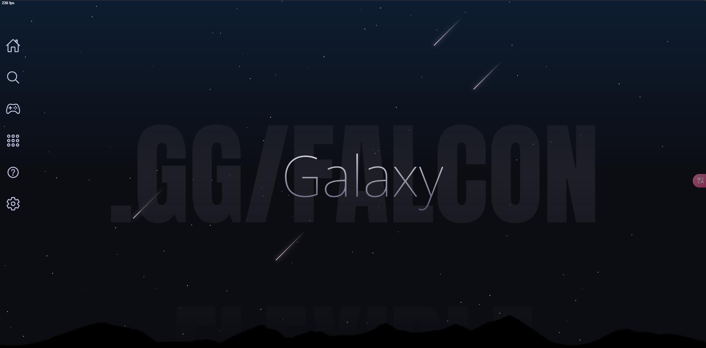
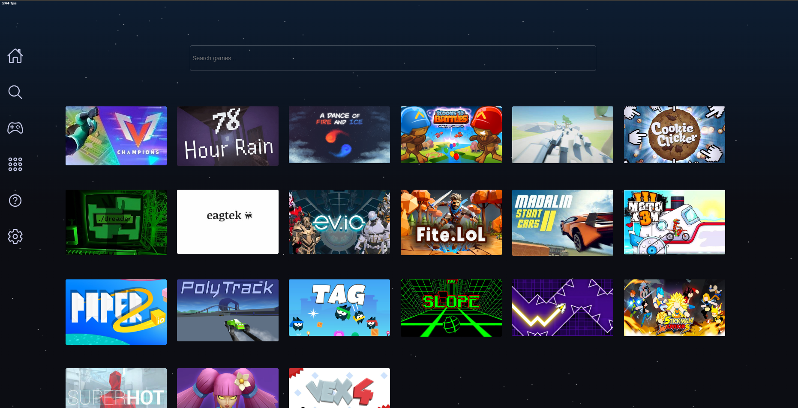
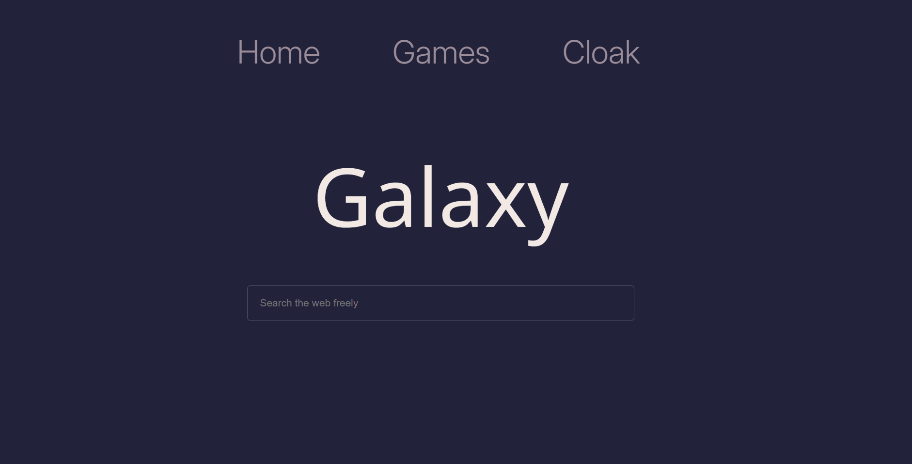

# Galaxy🪐

~Browse the internet with no restrictions

## About Galaxy📑

Galaxy is a minimalistic open source proxy that is capable of evading internet censorship. Galaxy uses Ultraviolet V3- the fastest and lastest version. It also includes a vast collection of games that will continuously expand as the site grows. 

## Demo 🏴󠁺󠁡󠁦󠁳󠁿

#### https://galacticsurf.boats/

## Run Galaxy Locally 🚀

##### Install Galaxy
```bash
git install https://github.com/r480github/GalaxyV3.git
cd GalaxyV3
```


<br>

##### Install dependencies

```bash
npm i  
```

##### Start

```bash
npm start
```
#### NOTE: The dafault port for Galaxy is 8000. You can visit it by typing localhost:8000/ into a web browser
<br>
    
## You can also deploy Galaxy on Koyeb(For Free)
[](https://app.koyeb.com/deploy?name=galaxyv3&type=git&repository=r480github%2FGalaxyV3&branch=master&builder=buildpack&regions=was&env%5B%5D=&ports=8000%3Bhttp%3B%2F)
<br>
<br>

## A look inside👀

<br>

### Home screen



#

### Games



#

### Proxy



## Credits

- [Titanium Network's awsome proxy](https://github.com/titaniumnetwork-dev/Ultraviolet)
- [Background made with Starback.js](https://github.com/zuramai/starback.js)
- [Discord Server](https://discord.com/invite/6wQTrrfNcr)
- [Icons](https://github.com/ionic-team/ionicons)
- [da best dev ever](https://github.com/r480github)
